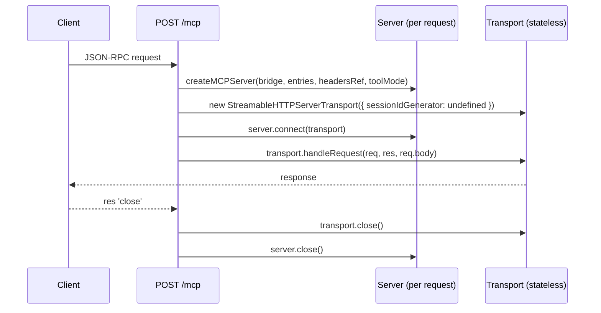

# MCP: Drop Sessions via Stateless Transport

**Revised 2026-08-23.** Two changes: (1) rescoped — this doc bundled the session teardown with adoption of the 2026-07-28 spec; only the first is doable, so the spec half moved to [2026-08-23 feat--mcp-2026-07-28-spec-adoption.md](2026-08-23%20feat--mcp-2026-07-28-spec-adoption.md). (2) the original's "one shared server" design is wrong — the SDK forbids it. See *Design Correction*.

## Overview

`src/mcp/index.ts` keeps a `Map` of live MCP sessions — a `Server` instance, a transport, and a headers ref per connected client — retained for 30 minutes behind a TTL sweep, with LRU eviction at 1000 entries. Every connected client pays for a full `Server` carrying identical handlers.

`@modelcontextprotocol/sdk` supports stateless transports today via `sessionIdGenerator: undefined`. Switching deletes all retained state: memory becomes O(in-flight requests) instead of O(connected clients), and the TTL sweep, the eviction path, and the `DELETE /mcp` teardown all disappear with it.

This does **not** adopt the 2026-07-28 spec — that stays blocked on the SDK and lives in the sibling doc. This is the transport-level win, available now on protocol `2025-11-25`.

## Impact Assessment

- **Scope**: Small — one file (`src/mcp/index.ts`, 170 → ~100 lines) plus test coverage
- **Risk**: Low — `mountMCP`'s signature, `createMCPServer`, the `headersRef` pattern, and middleware/`getContext` are all untouched
- **Affected areas**: `src/mcp/index.ts`, `test/mcp.ts`, `readme.md`

Assessment note: strictly a deletion — no new dependency, no new abstraction, no consumer-facing change, ships as a patch release. `readme.md` never documents sessions or `DELETE /mcp` (verified 2026-08-23), so user-facing docs likely need nothing. One observable protocol change: `GET /mcp` starts returning 405 instead of opening a stream.

## Design Correction

The original plan said one shared `Server` would handle all requests. **The SDK forbids that.** `Protocol.connect()` throws:

> Already connected to a transport. Call close() before connecting to a new transport, or use a separate Protocol instance per connection.

A `Server` holds exactly one transport at a time, so a shared instance would race or throw under concurrency.

The SDK's own stateless example (`dist/esm/examples/server/simpleStatelessStreamableHttp.js`) builds a **new `Server` and new transport per request** and closes both on `res.on('close')`. That is the shape to follow.

The win is unaffected — the goal was never sharing one server, it was not *retaining* a thousand of them. Construction cost per request is two `setRequestHandler` calls; the 30-minute retention is what actually cost memory.

## Deviations from Plan

**`HeadersRef` was dropped, not kept.** The plan said to keep it. The mutable ref box existed only so a long-lived server could read the *current* request's headers; with one server per request the headers are fixed, so the box was never mutated. `createMCPServer` now takes `headers: IncomingHttpHeaders` directly.

**Helper ordering was corrected.** `mountMCP` moved to the top of the file with `createMCPServer` and the two helpers below it, per `skill-coding` general.md rule 4 (entry function first).

## Review Fixes

Self-review after implementation caught seven issues in the new code; all are fixed and covered:

| Issue | Fix |
| --- | --- |
| Raw internal error text returned to the caller on the 500 path — this route answers before any auth middleware | Log the error object, return a fixed `Internal server error` |
| `console.error` bypassed `tbConfig.logs.error` and flattened the error to a string | Gate on `config.logs.error`, log the object |
| 405 responses omitted the `Allow` header RFC 7231 requires | `res.set('Allow', 'POST')`, asserted in tests |
| `transport.close()` was redundant — `Protocol.close()` already closes its transport | Dropped; `server.close()` covers both |
| Unused `req` param on `methodNotAllowed` | `_req` |
| `server.onerror` unset, so post-disconnect send failures were silent — the common path now, not a rare one | Wired to the `config.logs.error` gate |
| `req as any` / `res as any` carried over from the old handler | Removed — Express 5 types satisfy the transport |

Two risks were traced and cleared rather than fixed: `Protocol._onrequest` terminates its chain with `.catch`, so a send after client disconnect cannot produce an unhandled rejection; and Node always emits `close` on the response, so the per-request pair is never leaked.

## Architecture

## Task Breakdown

### src/mcp/index.ts

- [x] Delete the `Session` type and the `sessions` `Map` (keep `HeadersRef` — still needed per request)
- [x] Delete `SESSION_TTL_MS`, `SWEEP_INTERVAL_MS`, `MAX_SESSIONS`
- [x] Delete the sweep `setInterval` and its `unref()`
- [x] Delete `evictOldestSession`
- [x] Delete the `randomUUID` import
- [x] Rewrite the POST handler: build `headersRef` from `req.headers`, create a `Server` and a `sessionIdGenerator: undefined` transport, `connect`, `handleRequest`, then close both on `res.on('close')`
- [x] Delete the `mcp-session-id` lookup branch and the `Invalid or missing session` 400 response
- [x] Replace the shared `GET` handler with a 405 JSON-RPC `Method not allowed` response
- [x] Replace the `DELETE` route with the same 405 response
- [x] Wrap the handler body so a throw before `handleRequest` returns a 500 JSON-RPC error rather than hanging the socket

### test/mcp.ts

- [x] Confirm the existing suite still passes — it exercises `handleToolCall`/`getTools` directly and should be untouched by the transport change
- [x] Add a transport-level check: two concurrent `POST /mcp` calls both succeed (this is the case the old shared-server design would have broken)
- [x] Add a check that `GET /mcp` and `DELETE /mcp` return 405

### Verification

- [x] `npm run test:mcp`
- [x] `npm run lint` and `npm run dist`
- [x] Point a real MCP client at `/bridge/mcp` and confirm list + call work with no `Mcp-Session-Id` in play

## Documentation

- [x] `readme.md` — updated after all: the MCP section now states the server is stateless and names the trade-off (no server-initiated notifications). Better call than the original "skip it"
- [x] On commit: moved to `done/2026-08/` and copied to `typed-bridge/plans/2026-08/`, per `skill-task-planner` §2

## Questions & Doubts

1. **Does any consumer rely on `GET /mcp` opening a stream?**
    - Stateless mode has no server-initiated notifications, so the stream carries nothing — 405 is the honest answer and matches the SDK example.
    - Recommendation: ship the 405. Revisit only if a real client complains.
2. **Patch or minor release?**
    - Patch: no API surface changes.
    - Minor: `GET`/`DELETE` behavior changes observably.
    - Recommendation: **minor** — the API is unchanged but the wire behavior isn't, and a minor costs nothing.
