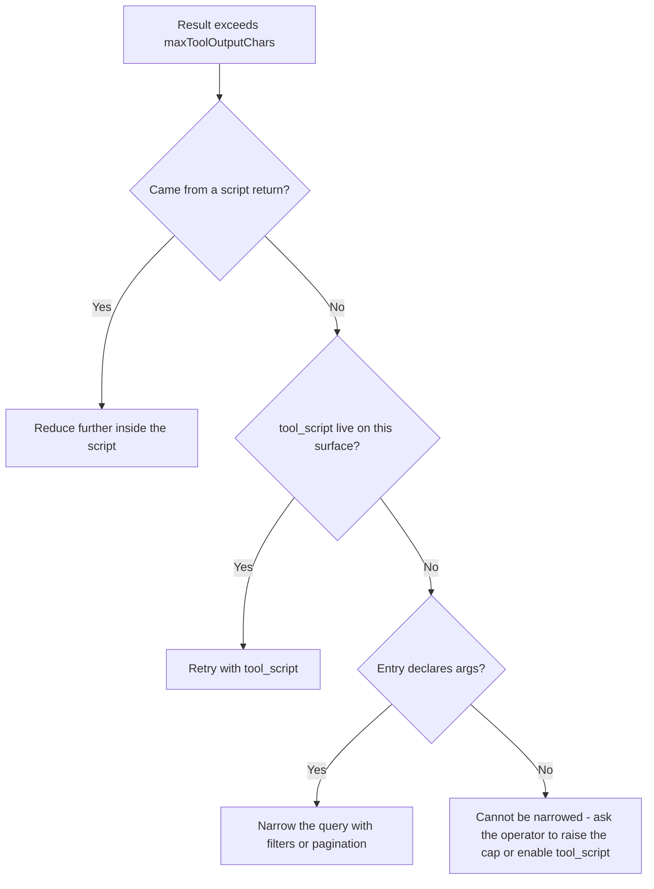

# Tool Output Cap Dead End Fix

## Overview

`tbConfig.maxToolOutputChars` (default 100k) rejects oversized tool results instead of truncating them. The rejection names one recourse — "Narrow the query with filters or pagination" — as a fixed string, and the real recourse (`tool_script`, which fetches uncapped inside the sandbox and returns a reduction) is not offered in `attach_all` mode.

Three defects follow:

1. **`tool_script` is never listed in `attach_all`.** `getTools` and the MCP `ListTools` handler both skip `getMetaTools` entirely in that mode. The tool still *executes* if called by name, because `handleToolCall` dispatches on name and is mode-agnostic. The cap has a door that is missing from the map.
2. **The cap error instructs an impossible action.** The message is a constant. An entry defined without `args` has no filter to add — the demo's own `analytics.events` (600 records, no `args`) is exactly this case. The model invents parameters, fails Zod validation, retries, and eventually answers the user wrong. Silent, and invisible to the library author.
3. **`runScript` does not limit `callTool` count.** Wall-clock (5s) and memory (64MB) are capped; call count is not. Each call runs the full middleware chain.

Defect 1 was already decided and never done. The original `tool_script` plan (`done/2026-07/2026-07-07 feat--tool-script-code-execution.md`, step 8) reads: *"Decide `attach_all` behavior: expose it in `attach_all` too if enabled (recommended, since `attach_all` users also hit the size limit)"* — checked `[x]`, not implemented. There is no design reason behind the current behavior; it is an unimplemented checklist item marked complete.

## Impact Assessment

- **Scope**: Medium — 4 source files, 2 test files, readme
- **Risk**: Low
- **Affected Areas**: `src/tools/index.ts`, `src/mcp/index.ts`, `src/tools/script.ts`, `src/config/index.ts`, `test/mcp.ts`, `test/script.ts`, `readme.md`

Assessment: no breaking changes. `enforceToolOutputLimit` and `toolUse` are not exported from `src/index.ts` and are not imported by tests, so their signatures can change freely. `getTools` keeps its return type; only the number of entries in the array changes. No new public API and no new config key except `script.maxToolCalls`. Semver minor.

Backward compatibility: a caller running `attach_all` with `script.enabled` true will now see one extra tool listed. That is the intended fix, and `tbConfig.script.enabled = false` remains the documented way to remove it.

## Architecture

The cap error becomes a function of what recourse actually exists:

Branch H is a genuine dead end. The fix is that it names itself and routes to the human who can act, instead of looping the model on an impossible instruction.

## Rejected alternatives

Recorded so they are not re-litigated:

- **Truncate the result.** A model receiving a silently shortened array cannot detect it and will state a wrong total confidently. A loud failure beats a silent one.
- **Truncate with a continuation cursor.** Cursors need per-client state or handler re-execution; `c9aaece` deliberately removed sessions for stateless request handling. An `{ items, cursor }` envelope would also break the declared `res` schema, forking the HTTP and AI return types.
- **MCP `resources` capability.** Relocates the payload rather than reducing it — the client fetches the resource straight into the model's context, which is what the cap exists to prevent. Legitimate as its own feature for file-like content; not an answer here.
- **Auto-enable `tool_script` whenever the cap is active.** Someone who set `script.enabled = false` likely did so under a policy against executing model-authored code. Overriding a security decision to preserve a convenience invariant is the wrong trade. The honest error message covers that case instead.
- **Per-entry `maxOutputChars` override.** Real but separate: it serves an author who knows an entry must be returned whole. Deferred until someone asks. If added, it takes a number, not an `uncapped: true` boolean, which invites blanket use.

## Task Breakdown

### Expose `tool_script` in both modes

- [x] Extract the `tool_script` definition out of `getMetaTools` into `getScriptTool({ format, surface, toolMode })`, returning `[]` when `config.script.enabled` is false or the surface is excluded
- [x] Give it a mode-aware description: `on_demand` keeps the "discover with `tool_search` / `tool_describe` first" sentence, `attach_all` replaces it with "call any tool listed here by name via `callTool`" — those two tools do not exist in `attach_all`, so shipping the current text there would swap one impossible instruction for another
- [x] `getMetaTools` calls the helper, preserving current `on_demand` output exactly
- [x] `getTools`: `attach_all` returns `[...toLLMTools(...), ...getScriptTool(...)]`
- [x] MCP `ListTools`: append the same helper's output to the `attach_all` branch
- [x] Fix the stale error text in `handleMetaToolCall` (omits `tool_script`) and the "three meta-tool names" comment above the four-element `META_TOOL_NAMES`

### Make the cap error tell the truth

- [x] `enforceToolOutputLimit(result, ctx?)` takes `{ toolName?, entry?, surface?, fromScript? }` and branches per the diagram above
- [x] Thread `entry` and `surface` to it through `toolUse`'s options bag; both call sites (`handleMetaToolCall`'s `tool_use` case, `handleToolCall`'s direct call) already have `entries` and `surface` in scope
- [x] `handleMetaToolCall`'s `tool_script` case passes `fromScript: true` so a bloated script return says "reduce further", not "retry with tool_script"

### Cap sandbox call count

- [x] Add `script.maxToolCalls: number` to config, default `50`, documented beside `timeoutMs` and `memoryBytes`
- [x] Count calls per run in `installCallTool`; over the limit, reject that `callTool` rather than killing the run, so the script's own code can catch it and still return something

### Tests

- [x] `attach_all` lists `tool_script` on both the `llm` and `mcp` surfaces
- [x] `attach_all` omits it when `script.enabled` is false, and when the surface is excluded
- [x] The output cap fires on a direct-name call — currently untested; only the `tool_use` path is covered
- [x] The error names `tool_script` when it is reachable
- [x] The error says "cannot be narrowed" for an args-less entry with script disabled, using the existing `analytics.events` fixture
- [x] `maxToolCalls` trips and surfaces a usable message

## Documentation

- [x] readme "Two modes" and `attach_all` sections: `tool_script` exposure is governed by `tbConfig.script`, independent of `toolMode`
- [x] readme `tool_script` section: available in both modes
- [x] readme config block: add `script.maxToolCalls`
- [x] readme "Guarding tool output size": name the preconditions instead of presenting `tool_script` as the unconditional answer, and state that an entry with no narrowing args and no script is a dead end by design
- [x] Done doc on commit — this doc is the record, moved to `done/2026-09/` and copied to the repo

## Doubts

### P2-1 · Whether `maxToolCalls` ships with this fix or later

**Resolved:** (a) — default applied, 2026-09-06. `script.maxToolCalls` (default 50) shipped in this change, enforced in `runToolCall` and surfaced in the `tool_script` description so the model knows its budget. Crossing it rejects the offending call rather than interrupting the run, so a script can catch the error and return what it already gathered.
