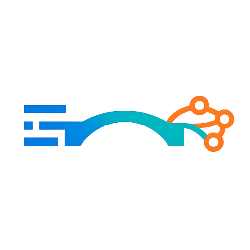
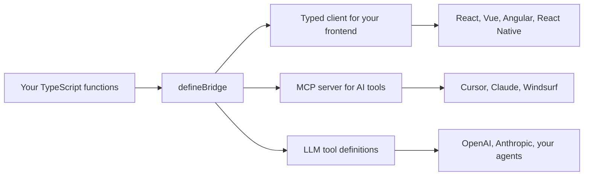

<div align="center">



# Typed Bridge

### Let AI talk to your API. Natively.

[](https://www.npmjs.com/package/typed-bridge)
[](https://www.npmjs.com/package/typed-bridge)
[](https://github.com/neilveil/typed-bridge/blob/main/license.txt)

**Write one TypeScript function. Get a typed client, OpenAI & Anthropic tools, and an MCP server — from a single Zod schema.**

</div>

---

## Stop maintaining two backends

Most backends now ship twice. Once for your app — then again for AI: tool schemas, an MCP server, agent integrations, all kept in sync by hand for months.

Typed Bridge kills the duplication. Write a TypeScript function once, describe it with Zod, and instantly get:

- A **fully typed API client** for your frontend — React, Vue, Angular, React Native, anything.
- **OpenAI & Anthropic tools** so your agents can call your backend.
- An **MCP server** for Cursor, Claude, and Windsurf.

And auth is not an afterthought: **agents inherit the exact same auth context and permissions as your users** — an agent can never reach something the signed-in user can't. One function. One schema. Every surface, secured the same way.

> Your backend just became AI-native.

---

## One function, three superpowers



You describe a function once with a Zod schema. Typed Bridge derives the client types, the MCP tool schema, and the LLM tool schema from that single source. They can never fall out of sync, because there is only one truth.

### What that unlocks

Point Claude or Cursor at your backend and it works across your real functions, with your real auth:

> **You:** "Email the invoice for order #1234 to the customer."
>
> The agent searches your tools, finds `order.fetch`, `invoice.create`, and `email.send`, reads their schemas, and calls them in turn — running as the signed-in user, blocked from anything that user can't touch.

No glue code. No tool schemas written by hand. No second backend. Just your functions.

---

## Quick start

### 1. Install

```bash
npm i typed-bridge
```

### 2. Define your contexts (optional)

Name the shapes your middleware injects, so handlers can declare what they expect. `bridge/context.ts`:

```ts
export type user = { id: number }
export type admin = { id: number; role: 'admin' }
export type guest = { requestedAt: number }
```

### 3. Define an entry

One self-contained object per handler — schema and logic together. `bridge/user/index.ts`:

```ts
import { z, defineEntry } from 'typed-bridge'
import * as context from '../context'

export const fetch = defineEntry({
    description: 'Fetch a user by ID',
    args: z.object({
        id: z.number().min(1).describe('Unique user identifier')
    }),
    res: z.object({
        id: z.number().describe('User ID'),
        name: z.string().describe('Full name'),
        email: z.string().describe('Primary email address')
    }),
    handler: async (args, ctx: context.user) => {
        return db.users.findById(args.id) // `args` is inferred as { id: number }
    }
})
```

`defineEntry` infers the handler's argument type from `args` and checks its return against `res` — no `z.infer<typeof ...>`, no manual `.parse()`, ever.

`.describe()` your `res` fields too, not just `args`. In `on_demand` mode the model reads the response schema via `tool_describe` before it calls, so those descriptions help it use the output correctly.

### 4. Register your entries

Map each route name straight to its entry. `bridge/index.ts`:

```ts
import { defineBridge } from 'typed-bridge'
import * as user from './user'

export const entries = {
    'user.fetch': user.fetch
}

export default defineBridge(entries)
```

A clean 1:1 mapping — `user.fetch` → `fetch`. No spreads, no schema copying. (Need to keep a handler off MCP or LLM? Add `mcp: false` / `llm: false` to its entry — covered in [Superpower 2](#choose-what-each-surface-can-touch).)

### 5. Boot the server, AI included

```ts
import { createBridge } from 'typed-bridge'
import bridge, { entries } from './bridge'

createBridge(bridge, 8080, '/bridge', { entries, mcp: true })
```

That is it. You now have a typed HTTP API and an MCP endpoint at `/bridge/mcp`. From one function.

---

## Superpower 1: The typed client

Generate a standalone client file for your frontend:

```bash
typed-bridge gen-typed-bridge-client --src ./src/bridge/index.ts --dest ./bridge.ts
```

Call your backend like it lives in the same file:

```ts
import bridge, { typedBridgeConfig } from './bridge'

typedBridgeConfig.host = 'http://localhost:8080/bridge'

const user = await bridge['user.fetch']({ id: 1 })
```

### Sending headers (auth and more)

Every request sends `typedBridgeConfig.headers`. Set them once after login, or update a single header any time — the change applies to all subsequent calls:

```ts
// Set the full header set (e.g. right after sign-in)
typedBridgeConfig.headers = {
    'Content-Type': 'application/json',
    Authorization: `Bearer ${token}`
}

// Or add / change one header on the fly
typedBridgeConfig.headers['X-Tenant'] = 'acme'

// Clear it on logout
delete typedBridgeConfig.headers['Authorization']
```

These headers are exactly what your `createMiddleware` chain reads on the server — and that same chain runs on HTTP, MCP, and LLM tool calls — so one token drives auth across every surface. You can also tap every response with `typedBridgeConfig.onResponse`:

```ts
typedBridgeConfig.onResponse = res => {
    if (res.status === 401) redirectToLogin()
}
```

Full autocomplete, full type safety, from server to screen. Your frontend never imports Zod and never sees your backend code. It is one generated file you can drop into React, Vue, Angular, React Native, or anything else.

---

## Superpower 2: The MCP server (the headline act)

Flip one flag and your backend becomes a [Model Context Protocol](https://modelcontextprotocol.io) server. AI tools connect to it and call your real functions, with your real validation.

```ts
createBridge(bridge, 8080, '/bridge', { entries, mcp: true })
```

Point any MCP client at it:

```json
{
    "mcpServers": {
        "my-backend": {
            "url": "http://localhost:8080/bridge/mcp",
            "headers": { "Authorization": "Bearer your-api-key" }
        }
    }
}
```

Typed Bridge is a **remote (HTTP) MCP server**, so the client just needs the `url` and any auth `headers` — those headers flow straight into your middleware chain. (The `env` block you may have seen elsewhere is only for **stdio** servers the client launches as a local process; there is no subprocess here, so it does nothing.)

### Auth that actually works

Your `createMiddleware` chain runs on MCP tool calls automatically — the client's forwarded headers are fed through the exact same pattern-matched middleware that guards HTTP. No separate config, no duplicated logic:

```ts
createMiddleware('user.*', async (req, res) => {
    const user = await verifyToken(req.headers['authorization'])
    if (!user) {
        res.status(401).json({ error: 'Unauthorized' })
        return { next: false }
    }
    return { context: { userId: user.id, role: user.role } }
})

createBridge(bridge, 8080, '/bridge', { entries, mcp: true })
```

The resolved context lands in every handler as the second argument, identically for a browser request and an agent's tool call — one security model for humans and AI. When a middleware blocks a tool call, the model receives the **status and message as JSON** (e.g. `{ "status": 401, "error": "Unauthorized" }`) so it knows *why* it was denied. On tool surfaces a middleware sees the request **headers** and the matched entry name as **`req.path`** (so path-based key derivation like `req.path.split('/').pop()` works everywhere) — but no request **body**, since MCP can forward nothing else.

### Control how many tools the client sees

A `toolMode` option, set once on `createBridge`, decides how the server presents tools (defaults to `on_demand`):

```ts
createBridge(bridge, 8080, '/bridge', { entries, mcp: true, toolMode: 'attach_all' })
```

In `on_demand` (the default) the server lists just `tool_search`, `tool_describe`, and `tool_use`, and the client discovers the rest as it needs them — ideal for a large API behind a single MCP connection. In `attach_all` it lists every exposed entry as its own tool. Same two modes power direct LLM tool calling too — see [Superpower 3](#superpower-3-llm-tool-calling).

`toolMode` controls **what's listed**, not what's reachable. It's a discovery strategy, not a sandbox: any entry visible to a surface stays callable (via `tool_use` or by its own name), so the two modes always execute identically. The hard boundary is the `mcp` / `llm` visibility flags — a hidden entry is never listed, discoverable, or callable.

### Choose what each surface can touch

MCP and LLM tools are independent surfaces. Every entry is exposed to both by default, and two flags — set right on the entry via `defineEntry` — hide a handler from either one while it stays fully callable over HTTP:

- `mcp: false` keeps a handler off the MCP server.
- `llm: false` keeps it out of `getTools` and tool search.

```ts
// Your LLM app can call it, external MCP clients cannot
export const remove = defineEntry({
    description: 'Remove a user',
    args: z.object({ id: z.number().min(1) }),
    res: z.object({ ok: z.boolean() }),
    mcp: false,
    handler: async (args, ctx: context.admin) => { ... }
})

// HTTP and MCP only, never an LLM tool
export const sync = defineEntry({
    description: 'Sync admin records',
    args: z.object({}),
    res: z.object({ synced: z.number() }),
    llm: false,
    handler: async (args, ctx: context.admin) => { ... }
})
```

Each flag governs its surface in **both modes** — under `attach_all` and `on_demand` alike, a hidden entry is neither attached directly nor discoverable through `tool_search`, and it is rejected if called by name. A model cannot reach it even by guessing.

---

## Superpower 3: LLM tool calling

Skip MCP and talk to models directly. Typed Bridge speaks OpenAI, Anthropic, and raw JSON Schema — and one option decides **how** your tools reach the model.

### Two modes, set with `toolMode`

- **`on_demand`** (default) — the model gets three meta-tools and discovers the rest as it needs them.
- **`attach_all`** — every eligible entry is attached as its own tool.

You choose per call, right where you build the tool list. No global state:

```ts
import { getTools, handleToolCall } from 'typed-bridge'

// Build the tool list (openai | anthropic | json-schema). Omit toolMode to use the default, on_demand.
const tools = getTools(entries, { toolMode: 'on_demand', format: 'openai' })

// Execute whatever the model called — same call for both modes.
// Forward the incoming request headers so your middleware chain (auth, context) runs here too.
const result = await handleToolCall(bridge, entries, toolCall, { headers: req.headers })
```

Because you pass `toolMode` explicitly, a single process can run one assistant with `attach_all` and another with `on_demand`. `handleToolCall` needs no mode at all — it dispatches on the tool name (a meta-tool name runs the discovery flow, anything else runs that entry directly), so your loop is written once and never changes when you switch modes.

Your `createMiddleware` chain runs on these tool calls just like it does on HTTP and MCP. Unlike MCP — where the server already holds the client's headers — an LLM loop is your own code, so you pass the request `headers` into `handleToolCall` to drive the chain. The middleware-derived context is merged on top of any `context` you also pass. If a needed header is missing, the matching middleware denies the call (the model receives a JSON `{ status, error }`), exactly as it would over HTTP.

### `on_demand` — three tools, discovered as needed (default)

Most APIs have more endpoints than a model should see at once, so this is the default. Do not flood the context window — give the model three tools instead of two hundred:

```ts
const tools = getTools(entries, { toolMode: 'on_demand', format: 'openai' })
// → tool_search, tool_describe, tool_use

// The model discovers, inspects, then calls:
// 1. tool_search({ query: "user" })       → [{ name: "user.fetch", description: "..." }, ...]
// 2. tool_describe({ name: "user.fetch" }) → { name, description, args, response }
// 3. tool_use({ name: "user.fetch", arguments: { id: 1 } }) → { id: 1, name: "Alice" }
```

The model calls `tool_search` to discover what exists (names and descriptions only), `tool_describe` to get the full schema for the tool it needs, then `tool_use` to run it. Your token bill stays flat as your API grows.

### `attach_all` — every tool, up front

```ts
const tools = getTools(entries, { toolMode: 'attach_all', format: 'openai' })
// → one tool per entry: user.fetch, product.create, ...
// Pass `tools` straight into openai.chat.completions.create()
```

Best when you have a handful of endpoints and want the model to see them all immediately.

> Two functions cover every case: `getTools` to build the tool list and `handleToolCall` to run whatever the model picks — in either mode.

---

## Why Typed Bridge

You could wire all of this by hand. Here is what you skip.

### vs hand-rolled REST + Express

|                     | **Typed Bridge**                          | **Hand-rolled REST**                          |
| ------------------- | ----------------------------------------- | --------------------------------------------- |
| Endpoints           | Plain functions, auto-routed              | Routes, controllers, and handlers wired by hand |
| Request validation  | Built in with Zod, automatic              | Added and maintained per route                |
| Client + types      | One generated file, always in sync        | Hand-written fetch calls and types, or none   |
| AI tooling          | MCP and LLM tools included                 | Build the whole AI layer yourself             |

### vs writing AI tools by hand

|                          | **Typed Bridge**                          | **DIY tool calling**                         |
| ------------------------ | ----------------------------------------- | -------------------------------------------- |
| Tool schemas             | Derived from your Zod types               | Hand written and kept in sync manually       |
| MCP server               | One flag                                  | A separate service to build and maintain     |
| Validation               | Shared with your API                      | Re-implemented for the AI path               |
| Drift between code and AI | Impossible, single source                | Constant, two sources                        |

### vs tRPC

|                        | **Typed Bridge**                              | **tRPC**                            |
| ---------------------- | --------------------------------------------- | ----------------------------------- |
| Setup                  | Plain functions, generate a client, done      | Routers, procedures, adapters       |
| Monorepo required      | No, the client is a standalone file           | Practically yes for type inference  |
| Frontend framework     | Any                                           | React first, adapters for others    |
| AI tooling             | Built in (MCP and LLM)                         | Not included                        |

tRPC has a deeper React/inference ecosystem and richer client features. Reach for Typed Bridge when you also want AI surfaces and a framework-agnostic, standalone client.

### vs GraphQL

|                    | **Typed Bridge**                          | **GraphQL**                                  |
| ------------------ | ----------------------------------------- | -------------------------------------------- |
| Setup              | Define functions, generate client         | Schema, resolvers, codegen                   |
| Type safety        | Automatic from signatures                 | Requires a codegen toolchain                 |
| Learning curve     | Minimal, plain TypeScript                 | SDL, resolvers, fragments, queries           |
| AI tooling         | Built in                                  | Roll your own                                |

GraphQL is unmatched when clients need to shape their own queries across a complex graph. Typed Bridge is the simpler choice when you want typed RPC plus native AI access, not a query language.

---

## Middleware when you need it

Pattern based middleware runs before handlers and can inject context. The **same chain runs on all three surfaces** — HTTP requests, MCP tool calls, and LLM tool calls — matched by entry name (e.g. `user.fetch` matches `user.*`). Over HTTP a middleware blocks by writing to `res`; on tool calls that same `res.status(code).send(msg)` is reported back to the model as JSON (`{ status, error }`). On tool surfaces a middleware sees `req.headers` and `req.path` (the matched entry name) but **no `req.body`** and no real `res` for side effects (cookies, custom headers are no-ops), so write auth/context logic against `req.headers` / `req.path`:

```ts
import { createMiddleware } from 'typed-bridge'

createMiddleware('user.*', async (req, res) => {
    if (!req.headers.authorization) {
        res.status(401).send('Unauthorized')
        return { next: false }
    }
    return { context: { id: 1 } } // shape matches `context.user` from bridge/context.ts
})
```

A middleware returns one of:

- `{ context }` — merge these values into the context and continue.
- `{ next: false }` — stop here. You must have sent a response (`res.status(...).send(...)`); the handler never runs.
- nothing — continue with no context change.

### Middlewares stack, broad to specific

Every middleware whose pattern matches the route runs, ordered from least to most specific (a literal segment counts as more specific than `*`). Each one's context is merged on top of the previous, so the handler receives the combined result:

```ts
createMiddleware('*', async () => {
    return { context: { requestedAt: Date.now() } } // runs first, for every route
})

createMiddleware('user.*', async (req, res) => {
    const token = req.headers.authorization
    if (!token?.startsWith('Bearer ')) {
        res.status(401).send('Unauthorized')
        return { next: false }
    }
    return { context: { userId: Number(token.split(' ')[1]) } }
})

createMiddleware('user.remove', async (req, res) => {
    if (req.headers['x-admin'] !== 'true') {
        res.status(403).send('Admin access required')
        return { next: false }
    }
    return { context: { isAdmin: true } }
})
```

A call to `user.remove` runs all three in order — `*` → `user.*` → `user.remove` — and the handler's `ctx` is the merged `{ requestedAt, userId, isAdmin }`. A call to `user.fetch` runs only the first two and gets `{ requestedAt, userId }`. If any middleware returns `{ next: false }`, the chain stops immediately and the rest never run.

### Reusing logic across middlewares

The pattern stacking above is automatic. When you instead want one middleware to *build on* another's logic, extract a plain function and call it — full control over order and short-circuiting:

```ts
const auth = async (req: Request, res: Response) => {
    const user = verifyToken(req.headers['x-auth-token'] || '')
    if (!user) {
        res.status(401).send('Unauthorized')
        return { next: false as const }
    }
    return { next: true as const, context: user }
}

createMiddleware('admin.*', async (req, res) => {
    const authRes = await auth(req, res)
    if (authRes.next === false) return authRes // 401 already sent

    if (!authRes.context.role.includes('admin')) {
        res.status(403).send('Forbidden')
        return { next: false }
    }

    return authRes // passes the authenticated user through as context
})
```

---

## Configuration

```ts
import { tbConfig } from 'typed-bridge'

tbConfig.logs.request = true
tbConfig.logs.response = true
tbConfig.logs.error = true
tbConfig.logs.argsOnError = true // Include handler args in error logs
tbConfig.logs.contextOnError = true // Include resolved context in error logs
tbConfig.responseDelay = 0 // Artificial delay in ms for testing loading states
tbConfig.maxToolOutputChars = 100_000 // Cap MCP/LLM tool results (chars of JSON); default 100_000, set 0 to disable
```

> Tool exposure (`attach_all` vs `on_demand`) is **not** global — you pass `toolMode` explicitly to `getTools` for your own loop, and to `createBridge` for the MCP server.

`createBridge` also returns the underlying Express `app` and `server`, so you can add routes, serve static files, or attach any Express middleware.

### Guarding tool output size

The same function can serve a data-heavy response over HTTP and as an AI tool. A frontend handles a large payload fine, but feeding it to a model wastes tokens or overflows the context window. So by default Typed Bridge caps tool results at **100,000 characters** on the **MCP and LLM tool surfaces only** (HTTP is never limited). Oversized results are **rejected, not truncated** — the caller gets an error telling it to narrow the query, so the model never receives invalid JSON:

```ts
// A tool result over the cap responds with:
// "Result too large (182431 chars, limit 100000). Narrow the query with filters or pagination."

tbConfig.maxToolOutputChars = 250_000 // raise it
tbConfig.maxToolOutputChars = 0       // or disable the cap entirely
```

---

## Adding a new route

1. Define the entry with `defineEntry` in `bridge/<module>/index.ts` (description, args, res, handler, plus any `mcp`/`llm` flags).
2. Register it in `bridge/index.ts` with a direct mapping: `export const entries = { 'module.action': module.action }` then `export default defineBridge(entries)`.
3. Add middleware if needed and import it in your server entry.
4. Regenerate the client.

---

## Upgrading from v3

v4 unifies the LLM and MCP tool paths behind two functions and a single `toolMode` option. The MCP server itself is unchanged — `mcp: true` still mounts `/bridge/mcp` — but `toolMode` now defaults to `on_demand`.

| v3                                                  | v4                                                            |
| --------------------------------------------------- | ------------------------------------------------------------ |
| `toolsFormat` option / `GET /bridge/tools` endpoint | Build the list in code: `getTools(entries, { toolMode, format })` |
| `toLLMTools(entries, { format })`                   | `getTools(entries, { toolMode: 'attach_all', format })`      |
| `getMetaTools({ format })`                          | `getTools(entries, { toolMode: 'on_demand', format })`       |
| `handleMetaToolCall(...)` / direct `toolUse(...)`   | `handleToolCall(bridge, entries, toolCall, { context, surface })` |
| `{ handler, ...types.fetch }` + separate `types.ts` | One `defineEntry({ ... })` object, mapped 1:1 in `entries`   |

`handleToolCall` is mode-agnostic: it dispatches on the tool name, so the same loop runs whether you chose `attach_all` or `on_demand`.

---

## Developer

Built and maintained by [neilveil](https://github.com/neilveil). If Typed Bridge saves you a codebase, drop a star.
