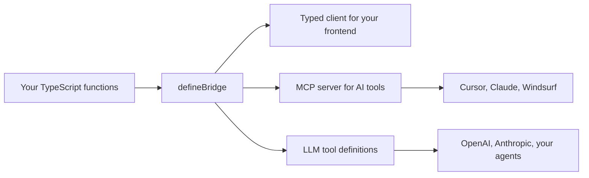

<div align="center">


# Typed Bridge

### Write one function. Get a typed API, an MCP server, and LLM tools.

[](https://www.npmjs.com/package/typed-bridge)
[](https://www.npmjs.com/package/typed-bridge)
[](https://github.com/neilveil/typed-bridge/blob/main/license.txt)

**Type-safe RPC for humans. Native tools for AI. Zero glue code.**

</div>

---

## Your backend just became AI-native

You already write plain TypeScript functions on your server. Typed Bridge takes those exact functions and hands you three things at once:

1. A **fully typed client** your frontend calls like local functions.
2. An **MCP server** so Cursor, Claude Desktop, and Windsurf can call your backend directly.
3. **LLM tool definitions** so OpenAI and Anthropic can use your backend as tools.

Same function. Same validation. No second codebase for AI. No hand written tool schemas. No drift.

> Every function you ship is instantly something an agent can call. That is the whole pitch.

---

## One function, three superpowers



You describe a function once with a Zod schema. Typed Bridge derives the client types, the MCP tool schema, and the LLM tool schema from that single source. They can never fall out of sync, because there is only one truth.

---

## Quick start

### 1. Install

```bash
npm i typed-bridge
```

### 2. Write a normal function

`bridge/user/index.ts`:

```ts
import { z } from 'typed-bridge'
import * as types from './types'

export const fetch = async (args: z.infer<typeof types.fetch.args>) => {
    return db.users.findById(args.id)
}
```

### 3. Describe it once

`bridge/user/types.ts`:

```ts
import { z } from 'typed-bridge'

export const fetch = {
    description: 'Fetch a user by ID',
    args: z.object({ id: z.number().min(1).describe('Unique user identifier') }),
    res: z.object({ id: z.number(), name: z.string(), email: z.string() })
}
```

### 4. Wire it up with `defineBridge`

`bridge/index.ts`:

```ts
import { defineBridge } from 'typed-bridge'
import * as user from './user'
import * as userTypes from './user/types'

export const entries = {
    'user.fetch': { handler: user.fetch, ...userTypes.fetch }
}

export default defineBridge(entries)
```

`defineBridge` auto-validates incoming args against your Zod schema. No manual `.parse()` in handlers, ever.

### 5. Boot the server, AI included

```ts
import { createBridge } from 'typed-bridge'
import bridge, { entries } from './bridge'

createBridge(bridge, 8080, '/bridge', { entries, mcp: true })
```

That is it. You now have a typed HTTP API, an MCP endpoint at `/bridge/mcp`, and an LLM tools endpoint at `/bridge/tools`. From one function.

---

## Superpower 1: The typed client

Generate a standalone client file for your frontend:

```bash
typed-bridge gen-typed-bridge-client --src ./src/bridge/index.ts --dest ./bridge.ts
```

Call your backend like it lives in the same file:

```ts
import bridge, { typedBridgeConfig } from './bridge'

typedBridgeConfig.host = 'http://localhost:8080/bridge'

const user = await bridge['user.fetch']({ id: 1 })
```

Full autocomplete, full type safety, from server to screen. Your frontend never imports Zod and never sees your backend code. It is one generated file you can drop into React, Vue, Angular, React Native, or anything else.

---

## Superpower 2: The MCP server (the headline act)

Flip one flag and your backend becomes a [Model Context Protocol](https://modelcontextprotocol.io) server. AI tools connect to it and call your real functions, with your real validation.

```ts
createBridge(bridge, 8080, '/bridge', { entries, mcp: true })
```

Point any MCP client at it:

```json
{
    "mcpServers": {
        "my-backend": {
            "url": "http://localhost:8080/bridge/mcp",
            "headers": { "Authorization": "Bearer ${MCP_API_KEY}" },
            "env": { "MCP_API_KEY": "your-api-key" }
        }
    }
}
```

### Auth that actually works

MCP requests skip your normal middleware, so you derive context straight from headers:

```ts
createBridge(bridge, 8080, '/bridge', {
    entries,
    mcp: true,
    mcpGetContext: async headers => {
        const user = await verifyToken(headers['authorization'])
        return { userId: user.id, role: user.role }
    }
})
```

The returned context lands in every handler as the second argument, exactly like middleware context. Same security model for humans and agents.

### Choose what each surface can touch

MCP and LLM tools are independent surfaces. Every entry is exposed to both by default, and two flags let you hide a handler from either one while it stays fully callable over HTTP:

- `mcp: false` keeps a handler off the MCP server.
- `llm: false` keeps it out of `toLLMTools`, tool search, and the `/bridge/tools` endpoint.

```ts
export const entries = {
    'user.fetch': { handler: user.fetch, ...userTypes.fetch },
    'user.remove': { handler: user.remove, ...userTypes.remove, mcp: false }, // your LLM app can call it, external MCP clients cannot
    'admin.sync': { handler: admin.sync, ...adminTypes.sync, llm: false } // HTTP and MCP only, never an LLM tool
}
```

Hidden tools are dropped from discovery and rejected if called by name, so a model cannot reach them even by guessing.

---

## Superpower 3: LLM tool calling

Skip MCP and talk to models directly. Typed Bridge speaks OpenAI, Anthropic, and raw JSON Schema.

### Hand every tool to the model

```ts
import { toLLMTools } from 'typed-bridge'

const tools = toLLMTools(entries, { format: 'openai' })
// Pass `tools` straight into openai.chat.completions.create()
```

Formats: `openai`, `anthropic`, `json-schema`.

### Have a giant API? Use meta-tools.

For hundreds of endpoints, do not flood the context window. Give the model three tools instead of two hundred:

```ts
import { getMetaTools, handleMetaToolCall } from 'typed-bridge'

const tools = getMetaTools({ format: 'openai' })

// The model discovers tools, inspects their schema, then calls them:
// 1. tool_search({ query: "user" })       → [{ name: "user.fetch", description: "..." }, ...]
// 2. tool_describe({ name: "user.fetch" }) → { name, description, args, response }
// 3. tool_use({ name: "user.fetch", arguments: { id: 1 } }) → { id: 1, name: "Alice" }

const result = await handleMetaToolCall(bridge, entries, {
    name: 'tool_use',
    arguments: { name: 'user.fetch', arguments: { id: 1 } }
})
```

The model calls `tool_search` to discover what exists (names and descriptions only), `tool_describe` to get the full schema for the tool it needs, then `tool_use` to run it. Your token bill stays flat as your API grows.

### Or just hit the REST endpoint

```
GET /bridge/tools?format=openai
```

---

## Why Typed Bridge

### vs writing AI tools by hand

|                          | **Typed Bridge**                          | **DIY tool calling**                         |
| ------------------------ | ----------------------------------------- | -------------------------------------------- |
| Tool schemas             | Derived from your Zod types               | Hand written and kept in sync manually       |
| MCP server               | One flag                                  | A separate service to build and maintain     |
| Validation               | Shared with your API                      | Re-implemented for the AI path               |
| Drift between code and AI | Impossible, single source                | Constant, two sources                        |

### vs tRPC

|                        | **Typed Bridge**                              | **tRPC**                            |
| ---------------------- | --------------------------------------------- | ----------------------------------- |
| Setup                  | Plain functions, generate a client, done      | Routers, procedures, adapters       |
| Monorepo required      | No, the client is a standalone file           | Practically yes for type inference  |
| Frontend framework     | Any                                           | React first, adapters for others    |
| AI tooling             | Built in (MCP and LLM)                         | Not included                        |

### vs GraphQL

|                    | **Typed Bridge**                          | **GraphQL**                                  |
| ------------------ | ----------------------------------------- | -------------------------------------------- |
| Setup              | Define functions, generate client         | Schema, resolvers, codegen                   |
| Type safety        | Automatic from signatures                 | Requires a codegen toolchain                 |
| Learning curve     | Minimal, plain TypeScript                 | SDL, resolvers, fragments, queries           |
| AI tooling         | Built in                                  | Roll your own                                |

---

## Middleware when you need it

Pattern based middleware runs before handlers and can inject context:

```ts
import { createMiddleware } from 'typed-bridge'

createMiddleware('user.*', async (req, res) => {
    if (!req.headers.authorization) {
        res.status(401).send('Unauthorized')
        return { next: false }
    }
    return { context: { userId: 1 } }
})
```

Broader patterns run first (`*`, then `user.*`, then `user.fetch`). Returned context is merged and passed to the handler.

---

## Configuration

```ts
import { tbConfig } from 'typed-bridge'

tbConfig.logs.request = true
tbConfig.logs.response = true
tbConfig.logs.error = true
tbConfig.responseDelay = 0 // Artificial delay in ms for testing loading states
tbConfig.maxToolOutputChars = 0 // Cap MCP/LLM tool results (chars of JSON); 0 = unlimited
```

`createBridge` also returns the underlying Express `app` and `server`, so you can add routes, serve static files, or attach any Express middleware.

### Guarding tool output size

The same function can serve a data-heavy response over HTTP and as an AI tool. A frontend handles a large payload fine, but feeding it to a model wastes tokens or overflows the context window. Set `tbConfig.maxToolOutputChars` to cap the serialized result on the **MCP and LLM tool surfaces only** (HTTP is never limited). Oversized results are **rejected, not truncated** — the caller gets an error telling it to narrow the query, so the model never receives invalid JSON:

```ts
tbConfig.maxToolOutputChars = 100_000

// A tool returning more than that responds with:
// "Result too large (182431 chars, limit 100000). Narrow the query with filters or pagination."
```

---

## Adding a new route

1. Create the handler in `bridge/<module>/index.ts`.
2. Add its Zod schema in `<module>/types.ts`.
3. Register it in `bridge/index.ts`:
    - Flat map for a plain typed API: `export default { 'module.action': module.action }`
    - Entry based for AI features: `export const entries = { 'module.action': { handler: module.action, ...moduleTypes.action } }` then `export default defineBridge(entries)`
4. Add middleware if needed and import it in your server entry.
5. Regenerate the client.

---

## Developer

Built and maintained by [neilveil](https://github.com/neilveil). If Typed Bridge saves you a codebase, drop a star.
